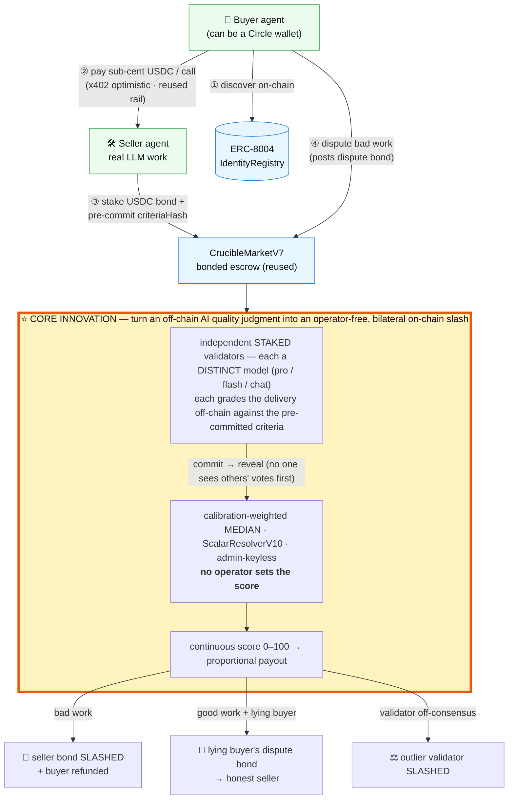

# Bazaar — Proof-of-Quality payments for AI services

> An autonomous agent pays **per call** for **real AI work**; if the work is bad, the provider's
> USDC bond is **slashed on-chain** by an independent staked-validator consensus and the buyer
> refunded — the chain enforces it, no platform takes a cut. (Honest scope of the live demo: see
> [Trust model](#trust-model--whats-real-vs-roadmap-honest).)

**The problem.** As AI agents start hiring each other, two things are missing: (1) a way to pay
**tiny amounts per call** (credit cards can't do sub-cent; subscriptions are too heavy), and
(2) any way to **trust** that paid AI work is actually good. Today you pay an AI API and just hope.

**Bazaar is the accountability layer.** Sellers are real AI services that **stake a USDC bond**;
a buyer agent discovers them on-chain (ERC-8004), pays **sub-cent USDC per call** on Arc, and
**grades the result**. Good work settles instantly; **under-delivery is auto-slashed on-chain** and
the buyer is refunded. No middleman holds funds or arbitrates — the chain enforces it.

A **Lepton Agents Hackathon** project (Canteen × Circle × Arc, Jun 2026).

> 🔎 **[Live evidence dashboard → ccheh.github.io/bazaar](https://ccheh.github.io/bazaar/)** — opens in your
> browser and calls Arc Testnet directly (read-only) to confirm every slash/payment transaction live, with
> Arcscan links. No install, no keys, no waiting — the web version of `npm run verify`.

## How it works



**The reused rails — x402 escrow, the bonded market, ERC-8004 discovery, Circle wallets — are plumbing.**
The ⭐ box is the core innovation: a **subjective off-chain AI-quality judgment becomes objective, credibly-neutral,
on-chain-enforced money** — decided by independent *staked* validators via commit-reveal (not an operator or an admin
oracle), as a **continuous** score, with **bilateral** accountability (bad seller slashed · lying disputer slashed ·
deviating validator slashed). Pre-committing `criteriaHash` fixes the rubric *before* delivery, so the question can't be
re-litigated after the fact — the exact failure mode that broke a $60M UMA dispute in June 2026.

## Reused, already deployed on Arc Testnet (chain 5042002) — zero new Solidity

| Piece | Address | Role |
|---|---|---|
| Cadence `PaymentEscrowV2` | `0xc95b1b20f91901206ba3ea94bbc7313e7cd82f8d` | per-call x402 USDC rail (native 18-dec USDC, signed claims) |
| Crucible v0 market + `MockResolver` **(fast demo — `npm run demo`)** | `0x61996d…f61c` / `0x76696e…d35f` | USDC-bond escrow + slash; mock resolver records the grade (fast, **not trustless**) |
| `CrucibleMarketV7` + `ScalarResolverV10` **(trustless slash — `npm run trustless`)** | `0x9934…fb59` / `0xb377…4c01` | **staked-validator commit-reveal**: the score that slashes the bond is the consensus of independent validators, not the operator |
| Circle **Developer-Controlled Wallets** **(`npm run circle:pay`)** | API (no contract) | an agent pays a seller a sub-cent USDC nanopayment from a Circle-managed wallet; Circle signs & broadcasts (we never hold the key) |

## Status (honest)

- **Slice 1 — DONE:** one autonomous, LLM-decided, **real on-chain** paid call over the Cadence rail.
- **Slice 2 (economy) — DONE:** multiple competing sellers (one a degrader) + a buyer that keeps
  **per-seller memory** and routes by it (logic in [economyBuyer.ts](src/agents/economyBuyer.ts)); a
  low grade triggers a real on-chain bond slash, and accepted calls settle via batched `claimBatch`.
  (Whether the buyer samples-and-routes-away from the degrader in a given run is emergent/LLM-driven,
  not scripted — run `npm run economy` to reproduce.)
- **Distinct per-agent wallets — DONE:** each seller runs under its own wallet; the settler groups
  claims by service and settles each as that seller (real multi-payee settlement on-chain).
- **Bonded quality / slash — DONE (real on-chain):** a degrader posts a USDC bond; the buyer
  disputes; the resolver scores it low and the bond is **slashed on-chain**, refunding the buyer
  (`npm run slash`). Demo uses the fast mock resolver; the decentralised commit-reveal
  ScalarResolverV10 is the production resolver (same market interface).
- **Slash wired into the economy loop — DONE:** a low buyer grade triggers a real on-chain bond
  slash mid-run (`npm run economy`), so under-delivery is penalised live, not just in a script.
- **Bring-Your-Own-Agent — DONE:** an external, independently-keyed agent joins the live market
  (`npm run market`, then `npm run byoa` with your own wallet + LLM key) and pays real USDC to the
  sellers — genuine cross-party, agent-to-agent traction (see [HANDBOOK.md](HANDBOOK.md)).
- **On-chain discovery (ERC-8004) — DONE:** sellers register on Circle's ERC-8004 IdentityRegistry
  with their endpoint as the agentURI (`npm run register`); buyers discover them from on-chain
  `Registered` events and probe the endpoints (no central list) — permissionless discovery.
- **TRUSTLESS slash — DONE (real on-chain, no operator-set score) — `npm run trustless`:** the score
  that slashes (or protects) a seller's bond is the **calibration-weighted median of independent
  STAKED validators** (`CrucibleMarketV7` + `ScalarResolverV10`; source in [contracts/v07](contracts/v07)),
  each running a **distinct model** via commit-reveal over the protocol's real 30+30-min windows. All four
  proofs below are from **one committed run** ([.trustless-state.json](.trustless-state.json)):
  - **bad delivery → consensus 0/100 → seller bond slashed 0.02 USDC, buyer refunded 0.03079**
    ([tx 0x5469f51c](https://testnet.arcscan.app/tx/0x5469f51c692717b14cedadd3a81bc754ae3821e1da8d6feab71684e9e125e4f3));
  - **good delivery + a lying buyer disputing it → consensus 100/100 → seller bond protected AND the liar
    forfeits its 0.001 dispute bond to the seller**
    ([tx 0x2d411523](https://testnet.arcscan.app/tx/0x2d41152349c03415d7f9528a195c2f1d21d69c413109431a70ca093daa8642d1));
  - an in-code assertion verifies, on these real numbers, that **a lying buyer cannot slash an honest
    seller** — PASS ✅;
  - **validator accountability**: V1/V2 graded with live distinct models (`deepseek-v4-pro`,
    `deepseek-v4-flash`), and V3 was forced off-consensus to demonstrate slashing deterministically →
    **V3 itself was slashed 0.00882 USDC** on-chain (in the bad-market tx above); the identical off-vote
    *within* tolerance of the 100/100 consensus was correctly NOT slashed.
  (A run with **three live distinct models** — pro/flash/chat — is `npm run circle:trustless`.)
- **External agent over the public rail — DONE — `npm run byoa:ext`:** a separate, independently-keyed
  agent (not the main buyer) funds its own escrow and pays a seller; the seller settles on-chain
  ([tx](https://testnet.arcscan.app/tx/0xac74ffeebb45f9760018916fb03196915184a075ed77b800a9218ad92cb4799a)).
  (Honest scope: a distinct self-funded wallet exercising the BYOA path end-to-end — not yet a real third party.)
- **Circle Developer-Controlled Wallets — DONE — `npm run circle:pay`:** an agent hires a seller, gets
  real LLM work, and pays a **sub-cent USDC nanopayment from a Circle-managed wallet** on ARC-TESTNET;
  Circle signs + broadcasts (we never hold the key) — committed proof in
  [`circle-pay.json`](circle-pay.json), [tx](https://testnet.arcscan.app/tx/0x4c6db2f95bcec0ff88a7578dda06228776527e5cd488a14a295b879c597c094f)
  (seller balance +0.002 USDC, verifiable). Set up with REST + Node crypto, **no SDK**.
- **Circle wallet THROUGH the bonded rail — `npm run circle:trustless`:** the Circle Developer-Controlled
  wallet is the **agent that opens AND disputes** a bonded `CrucibleMarketV7` market via Circle's
  contractExecution API (Circle signs/broadcasts) — so Circle funds are **load-bearing in the slash
  mechanism**, not a side transfer. Open ([tx 0x7c9b913b](https://testnet.arcscan.app/tx/0x7c9b913b8b98e0234c07a50210e70368f5d76bb3ff218274648ffd98b216330f))
  + dispute ([tx 0xf7ea1cbb](https://testnet.arcscan.app/tx/0xf7ea1cbb0ad4111a384e58d936782207b826a38beba4678a8cde36d1e43f4cd0))
  confirmed; the validator resolve (seller slash + refund back to the Circle wallet) lands after the 30+30-min windows.
- **Beginner onboarding agent — `npm run beginner`:** a simulated newcomer (Claude-powered, its OWN
  fresh wallet) reasons in a first-timer voice about which cheap service to try, then pays on-chain
  ([tx](https://testnet.arcscan.app/tx/0x478a24023ea97b276b3c811e63efb18074a4009dfca7a01a550b915b6bd43803),
  `beginner-agent.json`). The same script runs with a real person's own key — the literal onboarding path.
- Next: a real third-party agent; route the Circle payment's refund through to landing; App Kit dashboard.

Agent brain is provider-agnostic (DeepSeek / OpenAI-compatible / Anthropic); set `BAZAAR_MODEL`
(`deepseek-v4-pro` for headline runs, `deepseek-v4-flash` for the high-frequency economy loop).

## Trust model — what's real vs roadmap (honest)

We'd rather under-claim. What a single run actually proves today:

- **Real & on-chain:** sub-cent USDC per-call settlement; sellers' USDC **bonds are really slashed
  on-chain** when a buyer grades them below par (`npm run demo` prints the tx); distinct seller
  wallets; agents registered on the ERC-8004 IdentityRegistry.
- **Two slash paths, both real on-chain:** (1) `npm run demo` is the **fast** path — a mock resolver
  records the grade and the runner coordinates the dispute (great for a quick story, **not trustless**).
  (2) `npm run trustless` is the **trustless** path — the score is the commit-reveal consensus of
  independent **staked** validators on `ScalarResolverV10` (each running a **distinct model**);
  **no operator sets it**, and a lying buyer who disputes good work loses its own dispute bond
  (asserted PASS on-chain).
- **Honest scope of "trustless" today:** the *mechanism* is permissionless and stake-secured (anyone
  can stake; deviating from consensus is slashed on-chain — see the `ValidatorSlashed` demo). But in
  the current demo the validator wallets are **team-funded/operated** (distinct models, distinct keys,
  but same operator) — it is a faithful mechanism demonstration, not yet a real multi-party validator
  set. That last step (outside operators staking) is the remaining gap.
- **Circle wallets:** `npm run circle:pay` is a standalone DCW nanopayment (parallel proof). `npm run
  circle:trustless` goes further — the Circle wallet itself **opens + disputes** the bonded Crucible
  market (open/dispute txs confirmed), so Circle is wired **through** the slash rail; the validator
  resolve completes after the protocol windows. Either way Bazaar never holds the wallet's key.
- **External usage:** `npm run byoa:ext` puts a separate, independently-keyed agent into the
  settlement loop on-chain — but it is a self-funded wallet, not yet a real third party.
- **Discovery** resolves a **published agentId directory** (+ best-effort recent-event scan), read
  on-chain; it is not a full permissionless crawl (that needs an indexer).

## Run slice 1

```bash
cd bazaar
npm install
npm run demo       # ⭐ the whole story in plain English: see real answers, pay for good ones,
                   #    the bad one's bond is SLASHED and refunded to you — with on-chain tx links
npm run slice1     # one autonomous paid call, end-to-end
npm run economy    # multi-agent economy: competing sellers + memory-driven routing
npm run slash      # real on-chain bond slash: a degrader's USDC bond is slashed, buyer refunded
npm run trustless  # ⭐ TRUSTLESS slash: independent staked validators decide via commit-reveal;
                   #    proves a lying buyer can't slash an honest seller (~60min: protocol windows)
npm run circle:pay # agent pays a seller a sub-cent USDC nanopayment from a Circle wallet (Circle signs)
npm run circle:trustless # ⭐ Circle wallet OPENS+DISPUTES a bonded market through the slash rail (~60min)
npm run beginner   # a Claude-powered newcomer (own wallet) reasons + pays on-chain — the onboarding path
npm run register   # publish each seller's endpoint on the ERC-8004 registry (on-chain discovery)
npm run market     # keep the seller fleet live so external agents can join
npm run byoa       # external buyer DISCOVERS sellers on-chain + pays (set BYOA_PK to your wallet)
npm run byoa:ext   # independently-keyed agent funds its own escrow + pays a seller on-chain (traction proof)
npm run verify     # read-only: print every committed evidence tx + arcscan links (no keys/wait needed)
npm run settle     # operator batch-settles accepted claims on-chain
```

> First-time setup: copy `.env.example` → `../.env`, fill the keys, and run `node circle-setup.mjs`
> (creates the Circle wallets + `circle-wallets.json`) before the `circle:*` scripts.

It reads the shared Arc `../.env` (`PRIVATE_KEY` = buyer, `SERVICE_PRIVATE_KEY` = seller,
`ESCROW_V2_ADDRESS`). Set a `DEEPSEEK_API_KEY` (or `OPENAI_API_KEY` / `ANTHROPIC_API_KEY`) to enable
**real** LLM decisions; otherwise the agent uses a clearly-labeled heuristic so the on-chain loop
still runs. **Testnet only.**

**Committed evidence (verify, don't trust)** — run `npm run verify` to print them all with arcscan links.
Each in-repo file maps to exactly the tx hashes the README cites:
- `.trustless-state.json` — the trustless run: bad-slash `0x5469f51c`, lying-buyer forfeit `0x2d411523`, V3 validator slash (in the bad-market tx).
- `circle-pay.json` — Circle DCW nanopayment `0x4c6db2f9`.
- `.circle-trustless-state.json` — Circle wallet open `0x7c9b913b` + dispute `0xf7ea1cbb` (resolve outcome added when the windows close).
- `byoa-external.json` — external-agent payment `0xac74ffee`.
- `beginner-agent.json` — beginner agent payment `0x478a2402`.
- `.trustless-state.run1.json` — an earlier trustless run (kept for reference).

## Layout

```
src/
  config.ts          chain + accounts + env (loads ../.env)
  rail/escrow.ts      PaymentEscrowV2 client: signClaim / settle / verify (viem, EIP-712)
  agents/llm.ts       provider-agnostic LLM via fetch (DeepSeek / OpenAI / Anthropic; heuristic fallback)
  agents/validator.ts independent staked-validator grader (distinct model per validator)
  rail/crucible-v7.ts CrucibleMarketV7 + ScalarResolverV10 client (the trustless slash)
  rail/circle.ts      Circle Developer-Controlled Wallets REST client (no SDK)
  runner/trustless-slash.ts  the trustless slash + adversarial + outlier-slash demo
  market/seller.ts    paid HTTP-402 service on the rail
  runner/slice1.ts    the slice-1 demo
```

MIT.
